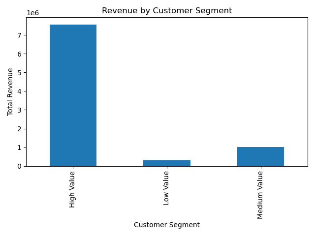
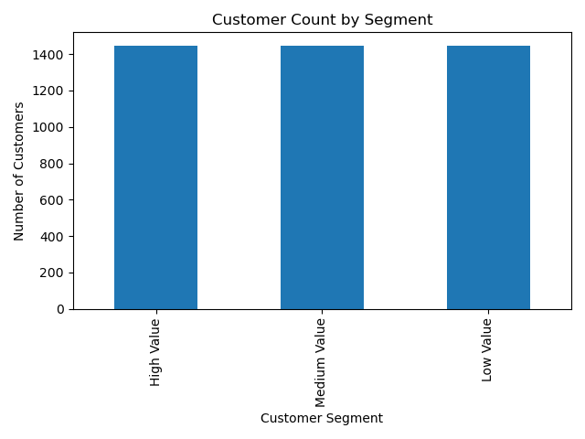

# Customer Segmentation Analysis (SQL + Python)

## Overview

This project analyzes transactional retail data to identify high-value customers and evaluate revenue concentration across customer segments.

Using SQL Server for data cleaning and aggregation, and Python (pandas & matplotlib) for analysis and visualization, customers were segmented based on total lifetime spend.

---

## Business Objective

Identify which customers drive the majority of revenue and determine how revenue is distributed across customer segments.

---

## Tools Used

- SQL Server (data cleaning, aggregation, segmentation)
- Python (pandas, matplotlib)
- Jupyter Notebook

---

## Data Cleaning (SQL)

- Removed cancelled invoices
- Removed returned orders (negative quantity)
- Removed records with missing CustomerID
- Created computed revenue column (TotalPrice)

---

## Segmentation Method

Customers were divided into three tiers using SQL’s `NTILE(3)` function based on TotalSpend:

- High Value
- Medium Value
- Low Value

---

## Key Findings

- The top third of customers generate **84.87% of total revenue**.
- High-value customers spend nearly **4x more per order** than low-value customers.
- Revenue distribution is highly concentrated, indicating strong prioritization opportunities for retention and loyalty strategies.

---

## Visualizations

### Revenue by Segment

### Customer Count by Segment

---

## Files Included

'''customer-segmentation-analysis/
├── analysis.ipynb
├── queries.sql
├── revenue_by_segment.png
├── customer_count_by_segment.png
└── data/
└── customer_segments_labeled.csv
'''

---

## Summary

This project demonstrates the ability to clean raw transactional data, perform customer-level aggregation, apply segmentation logic using SQL window functions, and translate analytical results into business insights.
